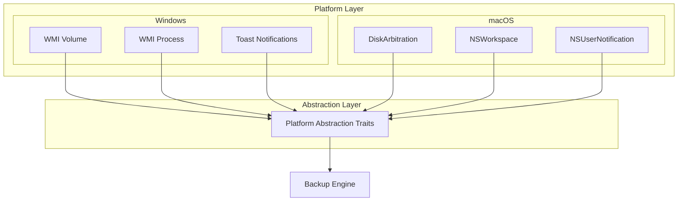
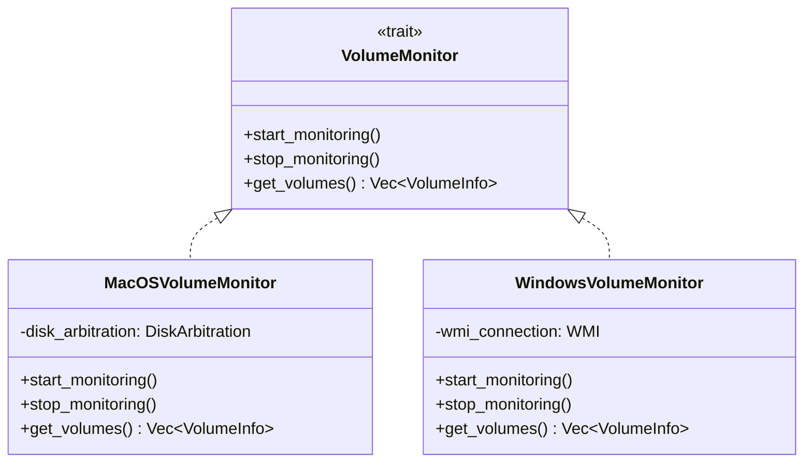

# Cross-Platform Updates Summary

This document summarizes all changes needed to make Backupper fully cross-platform (macOS + Windows).

## Files Already Updated

### ✅ REQUIREMENTS.md

**Changes Made**:

1. Updated project overview to mention "macOS and Windows"
2. Added Windows 10/11 to target platforms
3. Updated REQ-MOUNT requirements with platform-specific details (DiskArbitration vs WMI)
4. Changed "Menu Bar" to "System Tray" throughout
5. Updated permission requirements for both platforms
6. Added log file location conventions for both platforms
7. Updated launch at login mechanisms (LaunchAgents/SMAppService vs Registry/Task Scheduler)
8. Expanded filesystem requirements section (APFS/HFS+ vs NTFS/ReFS)
9. Added path separator and case sensitivity notes
10. Updated dependencies with platform-specific APIs
11. Enhanced risks table with platform-specific notes
12. Updated success criteria with platform-specific testing
13. Modified development phases to include platform abstraction

### ✅ README.md (Partial)

**Changes Made**:

1. Updated tagline from "macOS menu bar" to "cross-platform system tray"
2. Added Windows 10/11 to platform badge
3. Updated technology stack section
4. Added Windows prerequisites and installation instructions
5. Updated architecture highlights with cross-platform notes

---

## Files That Need Updates

### 📝 USER_STORIES.md

**Global Changes Needed**:

- Change "macOS" mentions to "cross-platform" or "macOS and Windows" where appropriate
- Add platform-specific implementation notes to relevant tasks
- Update time estimates for tasks that now need dual implementation

**Specific Updates**:

#### Epic 1: Project Setup & Foundation

- **User Story 1.2**: Menu Bar App → System Tray App
  - Task 1.2.1: Configure for both menu bar (macOS) and system tray (Windows)
  - Task 1.2.3: Design icons for both platforms (different size requirements)
  - Add time: +2 hours for Windows implementation

#### Epic 2: User Interface

- **User Story 2.1-2.3**: No major changes, UI is cross-platform with Tauri

#### Epic 3: Backup Engine Core

- **User Story 3.3**: Incremental Backups with Hardlinks
  - Add task: Implement Windows hardlink creation (CreateHardLink API)
  - Add task: Detect filesystem type on Windows (NTFS check)
  - Add task: Handle Windows long paths (\\?\ prefix for 260+ char paths)
  - Add time: +4 hours for Windows-specific implementation

#### Epic 4: Backup Triggers

- **User Story 4.1**: Volume Mount Detection

  - Add task: Implement Windows WMI volume monitoring
  - Add task: Handle Windows drive letter assignments
  - Add task: Test with various Windows drive types (USB, external, mapped)
  - Add time: +4 hours for Windows implementation

- **User Story 4.3**: Application Quit Monitoring
  - Add task: Implement Windows WMI process monitoring
  - Add task: Handle Windows application paths (Program Files, etc.)
  - Add time: +3 hours for Windows implementation

#### Epic 5: System Integration

- **User Story 5.1**: Launch at Login

  - Add task: Implement Windows registry/Task Scheduler integration
  - Add task: Handle Windows UAC considerations
  - Add time: +2 hours for Windows implementation

- **User Story 5.2**: Notifications

  - Add task: Implement Windows Toast notifications
  - Add task: Test notification persistence on Windows
  - Add time: +2 hours for Windows implementation

- **User Story 5.4**: Permission Handling
  - Add task: Implement Windows permission checks
  - Add task: Handle Windows UAC elevation requests
  - Add task: Guide users through Windows Defender/antivirus settings
  - Add time: +3 hours

#### Epic 6: Polish & Testing

- **User Story 6.3**: Testing

  - Add task: Set up Windows testing environment
  - Add task: Test on Windows 10 and Windows 11
  - Add task: Test on various Windows filesystems
  - Add time: +6 hours for cross-platform testing

- **User Story 6.5**: Distribution
  - Add task: Configure Windows installer (.msi or .exe with WiX/Inno Setup)
  - Add task: Set up Windows code signing
  - Add task: Test Windows installer
  - Add time: +4 hours

**New Estimated Total Time**: ~145-150 hours (from 120 hours)

---

### 📝 ARCHITECTURE.md

**Section Updates Needed**:

#### System Overview Diagram

```rust
// Add Windows-specific components in parallel to macOS ones

macOS System                          Windows System
├── DiskArbitration                  ├── WMI Win32_Volume
├── NSWorkspace                      ├── WMI Win32_Process
└── NSUserNotification               └── Windows.UI.Notifications
```

#### Module Structure (src-tauri/src/)

```
Add platform-specific modules:

src-tauri/src/
├── platform/
│   ├── mod.rs                    # Platform abstraction
│   ├── macos/
│   │   ├── volume_monitor.rs    # DiskArbitration
│   │   ├── process_monitor.rs   # NSWorkspace
│   │   ├── launch_agent.rs      # LaunchAgents
│   │   └── notifications.rs     # NSUserNotification
│   ├── windows/
│   │   ├── volume_monitor.rs    # WMI Win32_Volume
│   │   ├── process_monitor.rs   # WMI Win32_Process
│   │   ├── startup.rs           # Registry/Task Scheduler
│   │   └── notifications.rs     # Windows Toast
│   └── common.rs                # Shared traits/interfaces
```

#### Core Data Structures

Add platform-specific variants:

```rust
#[derive(Serialize, Deserialize, Clone, Debug)]
pub struct VolumeInfo {
    pub name: String,
    pub mount_point: PathBuf,
    #[cfg(target_os = "macos")]
    pub uuid: String,
    #[cfg(target_os = "windows")]
    pub serial_number: String,
    pub filesystem: String,  // "APFS", "HFS+", "NTFS", "ReFS"
    pub available_space: u64,
    pub total_space: u64,
}
```

#### Key Algorithms

Update hardlink creation:

```rust
#[cfg(target_os = "macos")]
fn create_hardlink(src: &Path, dst: &Path) -> Result<()> {
    std::fs::hard_link(src, dst)?;
    Ok(())
}

#[cfg(target_os = "windows")]
fn create_hardlink(src: &Path, dst: &Path) -> Result<()> {
    use windows::Win32::Storage::FileSystem::CreateHardLinkW;
    // Implementation using Windows API
    // Handle long paths with \\?\ prefix
    let src_wide = to_windows_path(src);
    let dst_wide = to_windows_path(dst);
    // ... CreateHardLinkW call
    Ok(())
}

fn to_windows_path(path: &Path) -> String {
    // Add \\?\ prefix for long path support
    if path.as_os_str().len() > 260 {
        format!("\\\\?\\{}", path.display())
    } else {
        path.display().to_string()
    }
}
```

#### Technical Constraints

Update dependencies section:

```markdown
### Platform-Specific Crates

**macOS**:

- `core-foundation` - macOS Core Foundation bindings
- `cocoa` - macOS Cocoa bindings
- `objc` - Objective-C runtime
- `security-framework` - Keychain access

**Windows**:

- `windows` - Official Windows API bindings
- `winapi` - Windows API (alternative)
- `wmi` - Windows Management Instrumentation
- `windows-registry` - Registry access

**Cross-Platform**:

- `tauri` - Main framework
- `serde` - Serialization
- `tokio` - Async runtime
- `walkdir` - Directory traversal
- `tracing` - Logging
```

#### Performance Considerations

Add Windows-specific notes:

```markdown
### Windows-Specific Optimizations

- Use `\\?\` prefix for paths >260 characters
- Batch CreateHardLink calls for performance
- Consider ReFS block cloning where available
- Handle Windows Defender real-time scanning delays
- Use Windows file system caching appropriately
```

---

### 📝 ROADMAP.md

**Updates Needed**:

#### Quick Start Guide

Already done in README, reference that.

#### Sprint Updates

- Add "+X hours" to sprints with platform-specific work (Sprints 4, 6, 7, 9)
- Update sprint 1 to include platform detection setup
- Add Windows testing to each sprint's testing checklist

#### Development Workflow

Add platform-specific testing notes:

````markdown
### Testing on Both Platforms

**macOS Development**:

```bash
npm run tauri dev  # Defaults to macOS
```
````

**Windows Development** (from macOS with VM or separate machine):

```bash
npm run tauri dev
# Or build for Windows:
npm run tauri build -- --target x86_64-pc-windows-msvc
```

**Cross-Compilation Notes**:

- Building Windows from macOS requires cross-compilation setup
- Recommend native development on each platform
- Use GitHub Actions for cross-platform CI/CD

````

#### Resources Section
Add Windows-specific resources:

```markdown
### Windows Development
- [Windows API Documentation](https://docs.microsoft.com/en-us/windows/win32/)
- [WMI Documentation](https://docs.microsoft.com/en-us/windows/win32/wmisdk/)
- [windows-rs Crate](https://github.com/microsoft/windows-rs)
- [Tauri Windows Guide](https://v2.tauri.app/distribute/windows/)
````

---

### 📝 QUICKREF.md

**Updates Needed**:

#### Common Commands

Add Windows-specific commands:

```powershell
# Windows PowerShell commands
npm run tauri dev
cargo test
cargo fmt
cargo check

# Build for Windows
npm run tauri build

# Cross-compile (if set up)
cargo build --target x86_64-pc-windows-msvc
cargo build --target aarch64-pc-windows-msvc
```

#### Platform-Specific Code Patterns

```rust
// Platform detection
#[cfg(target_os = "macos")]
fn platform_specific_function() {
    // macOS implementation
}

#[cfg(target_os = "windows")]
fn platform_specific_function() {
    // Windows implementation
}

// Conditional compilation
use cfg_if::cfg_if;

cfg_if! {
    if #[cfg(target_os = "macos")] {
        mod macos;
        pub use macos::*;
    } else if #[cfg(target_os = "windows")] {
        mod windows;
        pub use windows::*;
    }
}
```

#### Platform-Specific Debugging

```markdown
**Windows Debugging**:

- Use `cargo run` with `--verbose` flag
- Check Windows Event Viewer for system errors
- Use Process Monitor (procmon) for file system operations
- Use WMI Explorer for WMI query testing

**macOS Debugging**:

- Use Console.app for system logs
- Use `fs_usage` for file system monitoring
- Use `log show` for unified logging
```

---

### 📝 PLANNING_SUMMARY.md

**Updates Needed**:

- Change feasibility table to show platform-specific implementation status
- Update timeline to reflect additional Windows development time
- Add section on "Cross-Platform Challenges"
- Update success criteria to include both platforms

---

### 📝 DIAGRAMS.md

**Updates Needed**:

#### High-Level System Architecture

Update diagram to show parallel platform support:



#### Add new diagram: Platform Abstraction Pattern



---

### 📝 CHECKLIST.md

**Updates Needed**:

#### Add Platform-Specific Testing Sections

```markdown
## 🖥️ Platform Testing Checklist

### macOS Testing

- [ ] Test on macOS 11 (Big Sur)
- [ ] Test on macOS 12 (Monterey)
- [ ] Test on macOS 13 (Ventura)
- [ ] Test on macOS 14 (Sonoma)
- [ ] Test on Intel Mac
- [ ] Test on Apple Silicon (M1/M2/M3)
- [ ] APFS hardlinks working
- [ ] HFS+ hardlinks working (if supported)
- [ ] External SSD mount detection
- [ ] Menu bar integration native
- [ ] Notifications display correctly

### Windows Testing

- [ ] Test on Windows 10 (1809+)
- [ ] Test on Windows 11
- [ ] Test on x86_64 architecture
- [ ] Test on ARM64 (if available)
- [ ] NTFS hardlinks working
- [ ] ReFS hardlinks working (if available)
- [ ] External drive mount detection
- [ ] System tray integration native
- [ ] Toast notifications display correctly
- [ ] UAC elevation handled correctly
- [ ] Long path support (>260 chars) working
- [ ] Windows Defender compatibility

### Cross-Platform Testing

- [ ] Settings sync between platforms (if shared target)
- [ ] Backup format compatible between platforms
- [ ] Path handling works on both platforms
- [ ] UI looks native on both platforms
```

#### Update Total Estimates

```markdown
## 📊 Progress Summary (Updated for Cross-Platform)

### Overall Progress

**Total Tasks**: 220+ (increased from 185)
**Completed**: 0
**In Progress**: 0
**Not Started**: 220+
**Completion**: 0%
**Estimated Time**: 145-150 hours (increased from 120)
```

---

## Implementation Strategy

### Phase 1: Core Cross-Platform Foundation (Weeks 1-2)

1. Set up platform detection
2. Create platform abstraction traits
3. Implement basic file operations (cross-platform PathBuf usage)
4. Set up conditional compilation structure

### Phase 2: Platform-Specific Implementations (Weeks 3-6)

1. Implement macOS-specific modules
2. Implement Windows-specific modules in parallel
3. Test basic functionality on both platforms

### Phase 3: Integration & Testing (Weeks 7-10)

1. Integrate platform modules with core engine
2. Extensive cross-platform testing
3. Fix platform-specific bugs

### Phase 4: Polish & Distribution (Week 11)

1. Platform-specific installers
2. Code signing for both platforms
3. Documentation updates
4. Release preparation

---

## Recommended Rust Crates for Cross-Platform Support

### Essential Crates

```toml
[dependencies]
# Core
tauri = { version = "2.0", features = ["tray-icon", "notification"] }
serde = { version = "1.0", features = ["derive"] }
tokio = { version = "1", features = ["full"] }
tracing = "0.1"

# Cross-platform utilities
cfg-if = "1.0"
dirs = "5.0"  # Standard directories on all platforms

# Platform-specific (with conditional compilation)
[target.'cfg(target_os = "macos")'.dependencies]
core-foundation = "0.9"
cocoa = "0.25"
objc = "0.2"

[target.'cfg(target_os = "windows")'.dependencies]
windows = { version = "0.52", features = [
    "Win32_Storage_FileSystem",
    "Win32_System_Wmi",
    "Win32_System_Registry",
    "Win32_UI_Notifications"
] }
wmi = "0.13"
```

---

## Testing Strategy

### Unit Tests

- Write platform-agnostic tests first
- Use `#[cfg(target_os = "macos")]` and `#[cfg(target_os = "windows")]` for platform-specific tests
- Mock platform-specific APIs for cross-platform development

### Integration Tests

- Set up GitHub Actions with both macOS and Windows runners
- Test installers on fresh VMs
- Test upgrade scenarios

### Manual Testing Checklist

- [ ] Deploy to test machine (macOS)
- [ ] Deploy to test machine (Windows)
- [ ] Test all triggers on both platforms
- [ ] Verify hardlinks on both filesystems
- [ ] Test with large datasets on both
- [ ] Verify notifications on both
- [ ] Test startup on both
- [ ] Test permissions on both

---

## Known Platform Differences to Handle

### File Systems

| Feature          | macOS (APFS) | Windows (NTFS)           | Solution                   |
| ---------------- | ------------ | ------------------------ | -------------------------- |
| Hardlinks        | ✅ Supported | ✅ Supported             | Platform-specific API      |
| Max path length  | 1024 chars   | 260 chars (without \\?\) | Use \\?\ prefix on Windows |
| Case sensitivity | Optional     | Case-insensitive         | Normalize paths            |
| Path separator   | `/`          | `\`                      | Use `PathBuf`              |

### System Integration

| Feature            | macOS              | Windows                    | Implementation         |
| ------------------ | ------------------ | -------------------------- | ---------------------- |
| System Tray        | Menu bar (top)     | System tray (bottom-right) | Tauri handles          |
| Launch at login    | LaunchAgents       | Registry/Task Scheduler    | Platform-specific code |
| Notifications      | NSUserNotification | Windows.UI.Notifications   | Platform-specific code |
| Volume monitoring  | DiskArbitration    | WMI/DeviceChange           | Platform-specific code |
| Process monitoring | NSWorkspace        | WMI Win32_Process          | Platform-specific code |

### Permissions

| Need               | macOS            | Windows          | Handling             |
| ------------------ | ---------------- | ---------------- | -------------------- |
| File access        | Full Disk Access | No special perm  | Guide users on macOS |
| Volume monitoring  | No special perm  | Admin (optional) | Graceful degradation |
| Process monitoring | Accessibility    | Admin (optional) | Graceful degradation |
| Startup            | User approval    | User approval    | Standard OS prompts  |

---

## Documentation Checklist

- [x] REQUIREMENTS.md updated
- [x] README.md updated (partial)
- [ ] USER_STORIES.md - needs task additions and time adjustments
- [ ] ARCHITECTURE.md - needs platform-specific sections
- [ ] ROADMAP.md - needs Windows development notes
- [ ] QUICKREF.md - needs Windows commands and patterns
- [ ] PLANNING_SUMMARY.md - needs cross-platform notes
- [ ] DIAGRAMS.md - needs updated diagrams
- [ ] CHECKLIST.md - needs platform testing sections

---

## Next Steps

1. **Review this document** - Make sure all changes align with your vision
2. **Update remaining documentation** - Apply changes to files listed above
3. **Adjust scope if needed** - Decide if some platform-specific features should be phase 2
4. **Begin development** - Start with Sprint 1 including platform abstraction setup

---

**Questions for Refinement**:

1. **Priority**: Should we implement both platforms simultaneously or macOS first, then Windows?
2. **Scope**: Any features that should be platform-exclusive initially?
3. **Testing**: Do you have access to both macOS and Windows machines for testing?
4. **CI/CD**: Should we set up GitHub Actions for cross-platform builds from the start?
5. **Installers**: Preferences for Windows installer type (.msi with WiX or .exe with Inno Setup)?

---

**Estimated Impact on Timeline**:

- **Original estimate**: 120 hours (11 weeks part-time)
- **Updated estimate**: 145-150 hours (13-14 weeks part-time)
- **Additional time**: ~25-30 hours for Windows-specific implementation

This is a ~20-25% increase, which is reasonable for adding a second platform.
