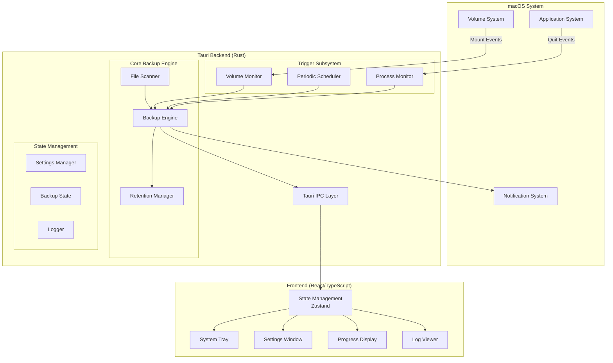
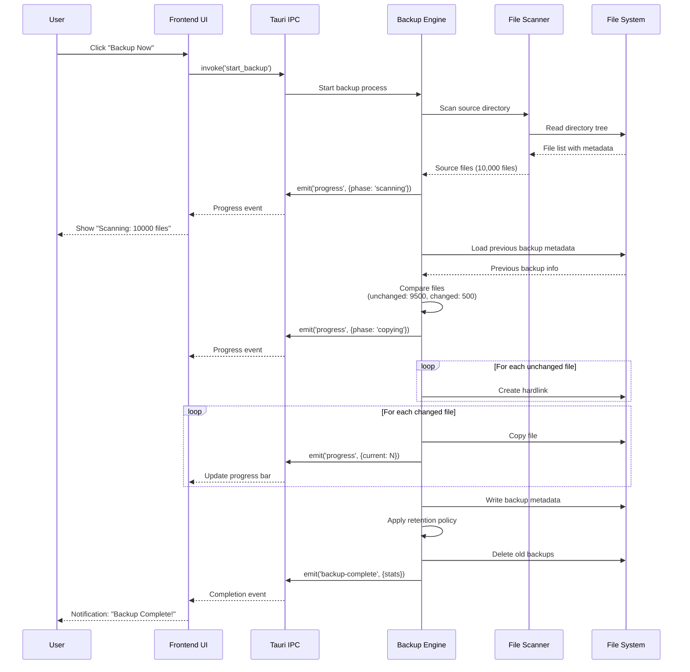
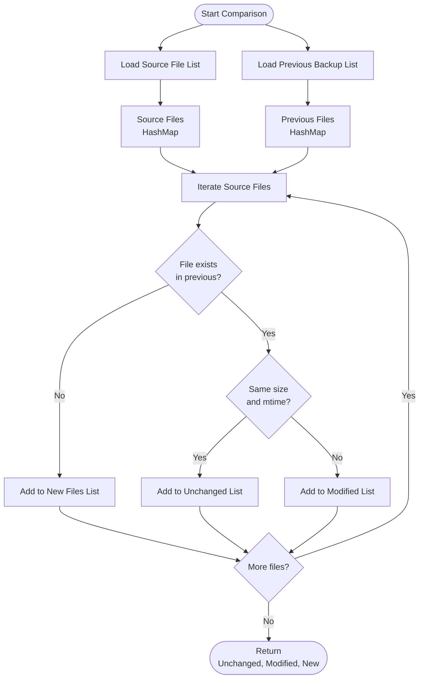
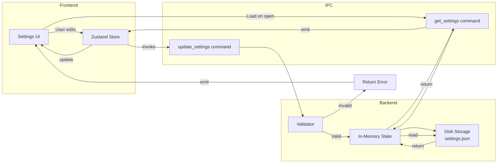
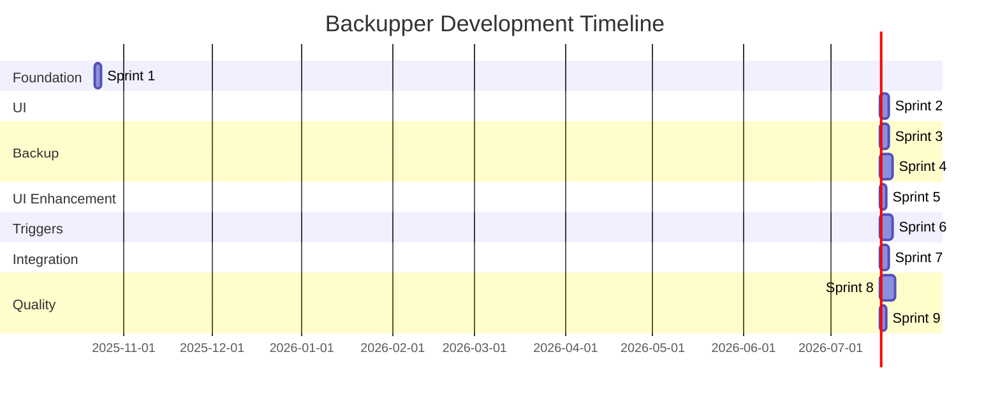
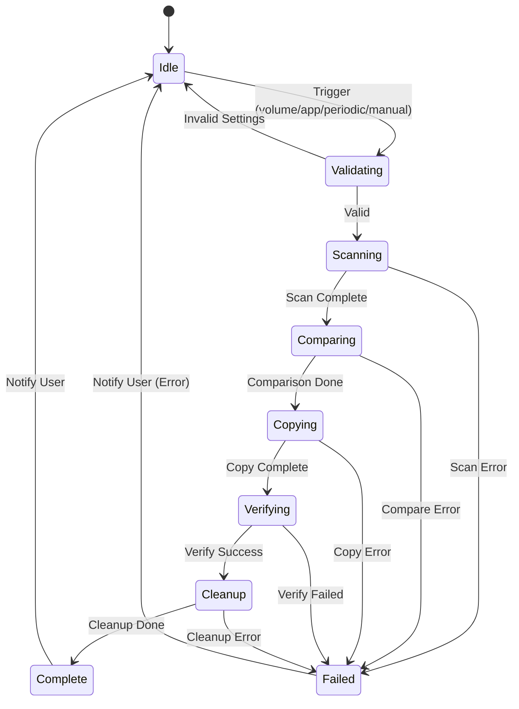
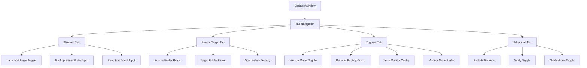
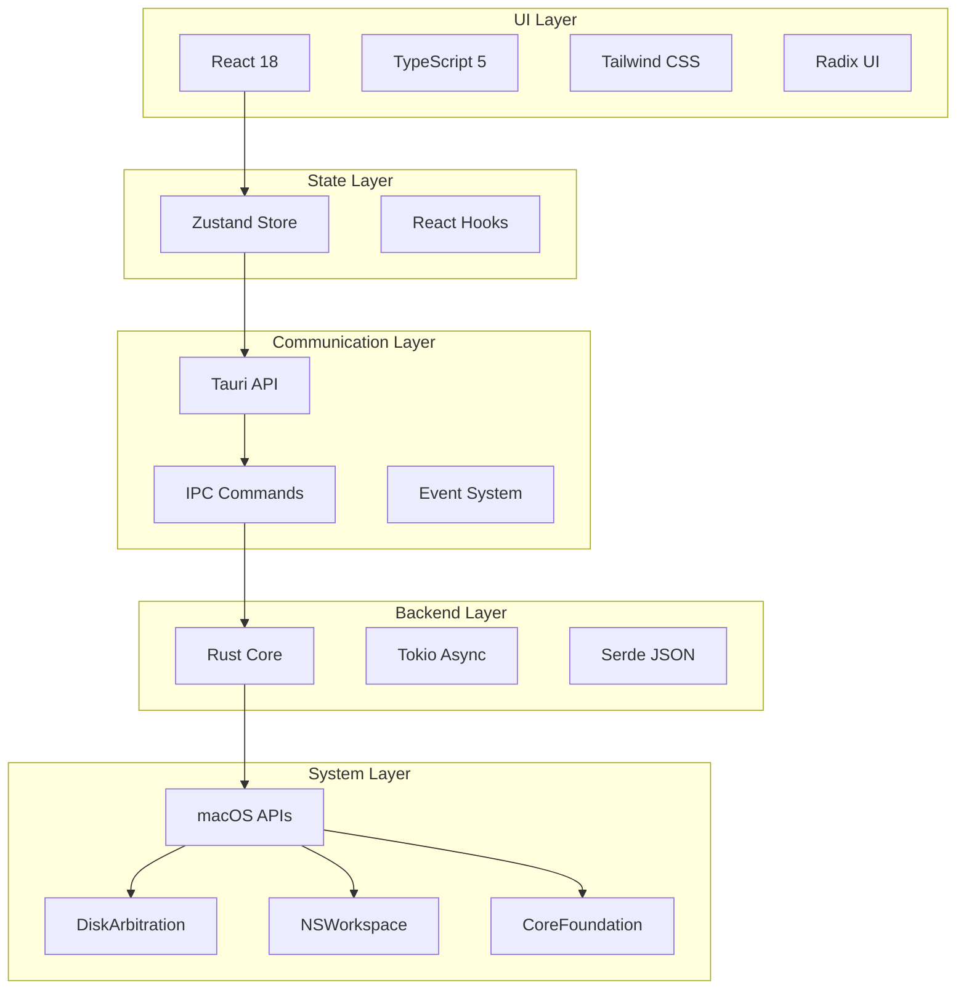
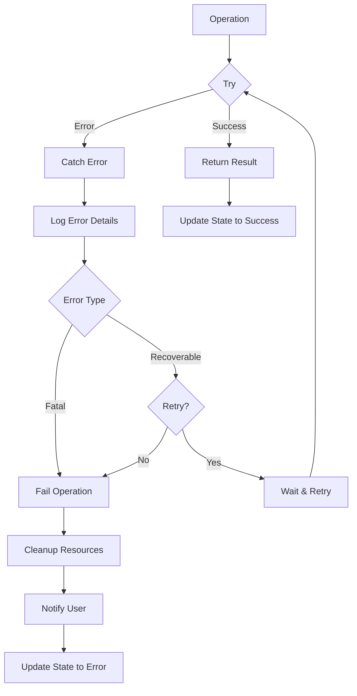
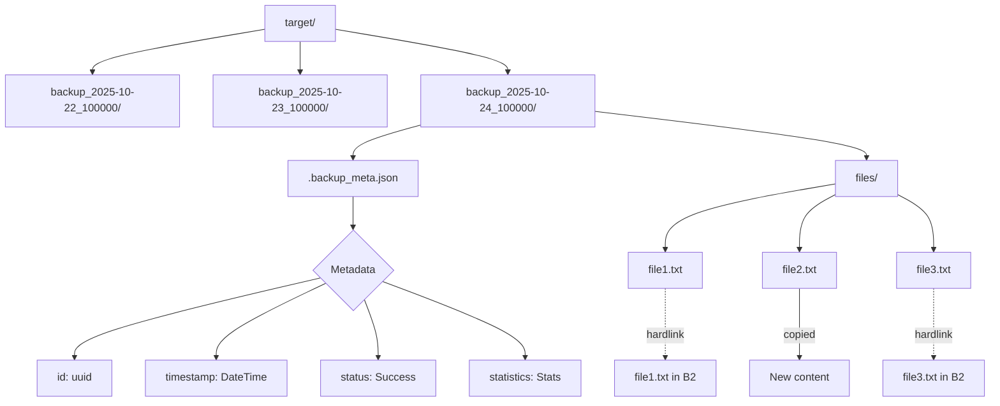

# System Architecture Diagrams

This document contains visual diagrams of the Backupper system architecture using Mermaid syntax.

## High-Level System Architecture



## Backup Workflow



## Trigger Flow

```mermaid
flowchart TD
    Start([System Events])

    Start --> VM{Volume<br/>Mounted?}
    Start --> AQ{App<br/>Quit?}
    Start --> TI{Timer<br/>Elapsed?}

    VM -->|Yes| VMC[Volume Monitor<br/>Check if source volume]
    VMC -->|Match| TC[Trigger Coordinator]

    AQ -->|Yes| PMC[Process Monitor<br/>Check monitored apps]
    PMC -->|Match| AMC{Monitor<br/>Mode?}
    AMC -->|ANY| TC
    AMC -->|ALL| AAQ{All apps<br/>quit?}
    AAQ -->|Yes| TC
    AAQ -->|No| Wait[Wait for more quits]

    TI -->|Yes| PER[Periodic Scheduler<br/>Check if enabled]
    PER -->|Enabled| TC

    TC --> Lock{Backup<br/>in progress?}
    Lock -->|No| StartBackup[Start Backup Engine]
    Lock -->|Yes| Skip[Skip - Already running]

    StartBackup --> Notify[Send Notification<br/>"Backup Starting"]
    Notify --> Execute[Execute Backup]
    Execute --> Complete[Send Notification<br/>"Backup Complete"]
```

## File Comparison Algorithm



## Settings Data Flow



## Sprint Timeline Gantt Chart



## State Machine: Backup States



## Component Hierarchy: Settings Window



## Technology Stack Layers



## Error Handling Flow



## File System Structure



## Development Workflow

```mermaid
flowchart LR
    subgraph "Development"
        Code[Write Code]
        Test[Test Locally]
        Commit[Git Commit]
    end

    subgraph "Review"
        Review[Code Review]
        Feedback[Feedback]
    end

    subgraph "Integration"
        Merge[Merge to Main]
        Build[Build]
        Deploy[Deploy/Release]
    end

    Code --> Test
    Test --> Commit
    Commit --> Review
    Review --> Feedback
    Feedback -->|Changes| Code
    Feedback -->|Approved| Merge
    Merge --> Build
    Build --> Deploy
```

---

## How to View These Diagrams

### In GitHub

These Mermaid diagrams will render automatically when viewing this file on GitHub.

### In VS Code

1. Install the "Markdown Preview Mermaid Support" extension
2. Open this file and press `Cmd+Shift+V` (or `Ctrl+Shift+V`)
3. Diagrams will render in the preview pane

### Export as Images

1. Use [Mermaid Live Editor](https://mermaid.live/)
2. Copy the diagram code
3. Export as PNG/SVG

---

**Note**: These diagrams complement the detailed text documentation in ARCHITECTURE.md and REQUIREMENTS.md. Refer to those documents for complete technical specifications.
